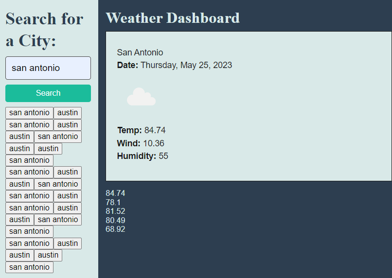

# Martins-Server-Side-APIs-Challenge-6
Weather Dashboard

## Description
This challenge was to build a weather dashboard that will run in the browser and feature dynamically updated HTML and CSS. Here I was able to learn and apply the material learned this past week about third-party APIs, and how to make requests with specific parameters to a URL.

## Usage

<a href="https://mardyyy.github.io/Martins-Server-Side-APIs-Challenge-6/"> Link to  Martins-Server-Side-APIs-Challenge-6</a>

## License

Refer to the LICENSE in the repo.